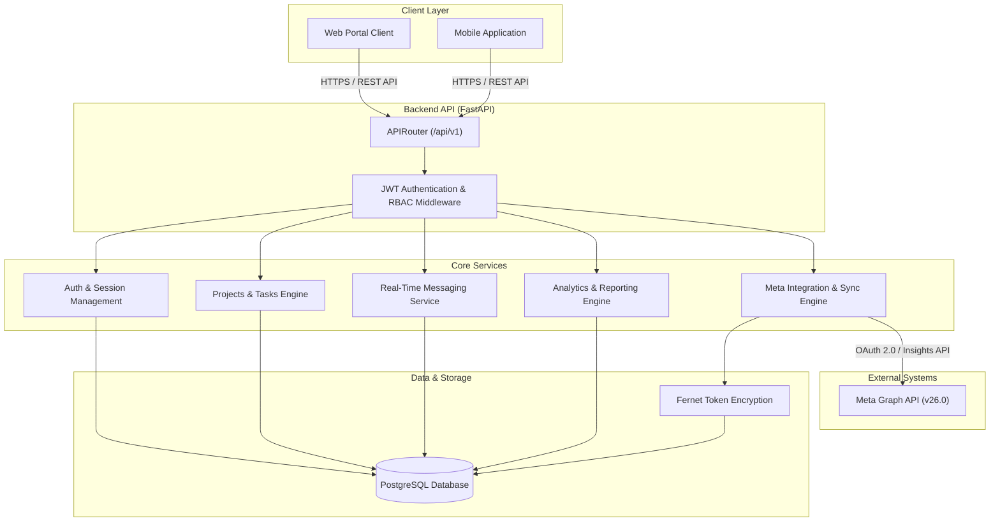

# Throttle Backend Architecture

This document describes the high-level architecture, design patterns, layer organization, and data flow of the Throttle Client Portal Backend.

---

## 1. System Architecture Diagram

---

## 2. Component Layers & Responsibilities

The Throttle backend is built with Python 3.12, FastAPI, and SQLAlchemy 2.0 (asyncio). It follows a clean 4-tier layered architecture:

| Layer | Location | Key Responsibilities |
|---|---|---|
| **API / Transport Layer** | `app/api/v1/` | Handles HTTP routing, request validation, Pydantic response formatting, HTTP exception handling, and endpoint protection via FastAPI dependency injection. |
| **Core & Security Layer** | `app/core/` | Configuration loading (`pydantic-settings`), JWT encoding/decoding, password hashing (`bcrypt`), Fernet encryption, database session management, and authentication dependencies. |
| **Service Layer** | `app/services/` | Business logic, calculations, external HTTP clients (`httpx`), Meta Graph API integrations, automated metrics processing, and notification dispatchers. |
| **Data Layer** | `app/models/` | Declarative SQLAlchemy ORM models, table schemas, relationship definitions, indexes, and database integrity constraints. |

---

## 3. Key Design Patterns

### 3.1 Dependency Injection
FastAPI's dependency injection (`Depends`) is used across all endpoints for:
- Database session lifecycle management (`DB` alias bound to `get_db`).
- Authentication verification (`CurrentUser` alias bound to `get_current_user`).
- Role-based authorization (`AdminUser` alias bound to `get_admin_user`).

### 3.2 Asynchronous I/O
- All database interactions use SQLAlchemy 2.0 async engine (`asyncpg` for PostgreSQL in production/development, `aiosqlite` for in-memory testing).
- External API calls to Meta Graph API use `httpx.AsyncClient`.

### 3.3 Strict Tenant Isolation
Every database query involving client organization data explicitly filters by `organization_id == current_user.organization_id`. Tenant identity is derived strictly from the verified JWT sub/org claims.

### 3.4 Encryption at Rest
External integration access tokens (such as Meta OAuth tokens) are encrypted prior to database insertion using Fernet symmetric encryption (`cryptography.fernet`).
