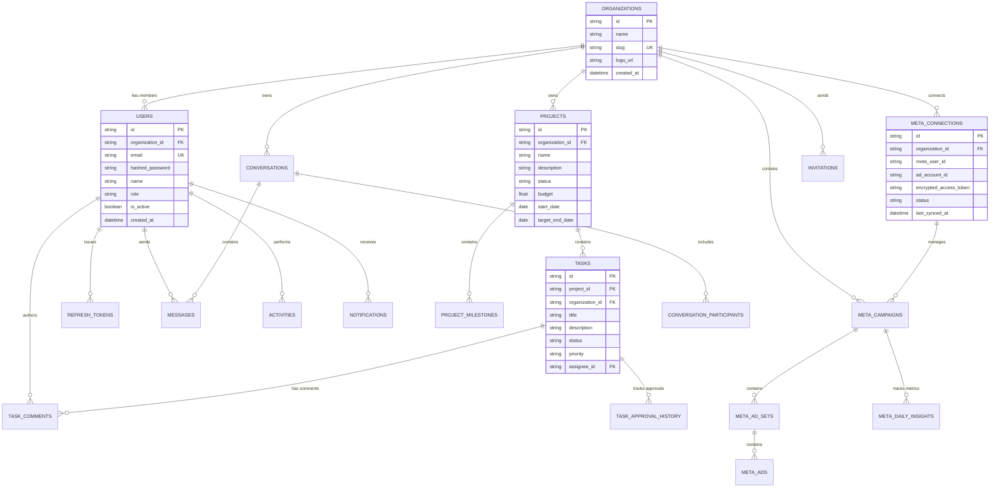

# Throttle Database Specification & Schema

This document details the database architecture, table schemas, entity relationships, migrations system, and data seeding routines.

---

## 1. Overview & Engine Stack

- **ORM**: SQLAlchemy 2.0 (Declarative Mapping)
- **Drivers**: `asyncpg` (PostgreSQL - primary), `aiosqlite` (SQLite - testing/local fallback)
- **Migrations**: Alembic 1.13.3 (`alembic.ini`, `alembic/env.py`)
- **Naming Conventions**: Snake_case table names and explicit Foreign Key relationships

---

## 2. Entity Relationship Diagram (ERD)



---

## 3. Key Model Definitions

### 3.1 Organization & User Management
- **`organizations`**: Multi-tenant isolation anchor (`id`, `name`, `slug`, `logo_url`).
- **`users`**: System user accounts (`id`, `organization_id`, `email`, `hashed_password`, `name`, `role`, `is_active`).
- **`refresh_tokens`**: Revocable refresh token store (`id`, `user_id`, `token_hash`, `expires_at`, `revoked_at`).
- **`invitations`**: Pending user organization invites (`id`, `organization_id`, `email`, `role`, `token`, `status`).

### 3.2 Projects & Task Management
- **`projects`**: Client projects (`id`, `organization_id`, `name`, `description`, `status`, `budget`, `start_date`, `target_end_date`).
- **`project_milestones`**: Key project progress targets (`id`, `project_id`, `title`, `status`, `due_date`).
- **`tasks`**: Work items (`id`, `project_id`, `organization_id`, `title`, `description`, `status`, `priority`, `assignee_id`).
- **`task_comments`**: Discussion on tasks (`id`, `task_id`, `user_id`, `comment_text`).
- **`task_approval_history`**: Audit trail for client task approvals and change requests (`id`, `task_id`, `status_from`, `status_to`, `action_by_user_id`, `notes`).

### 3.3 Messaging & Activities
- **`conversations`**: Chat thread metadata (`id`, `organization_id`, `title`, `project_id`).
- **`conversation_participants`**: Thread participants link (`id`, `conversation_id`, `user_id`, `last_read_at`).
- **`messages`**: Chat messages (`id`, `conversation_id`, `sender_id`, `content`).
- **`activities`**: Audit log events (`id`, `organization_id`, `user_id`, `action_type`, `entity_type`, `entity_id`, `description`).
- **`notifications`**: User alert notifications (`id`, `user_id`, `title`, `message`, `is_read`, `notification_type`).

### 3.4 Meta Marketing API Entities
- **`meta_connections`**: Meta OAuth ad connection details (`id`, `organization_id`, `meta_user_id`, `ad_account_id`, `encrypted_access_token`, `status`, `last_synced_at`).
- **`meta_campaigns`**: Meta ad campaigns (`id`, `organization_id`, `ad_account_id`, `meta_campaign_id`, `name`, `status`, `objective`, `daily_budget`, `lifetime_budget`).
- **`meta_ad_sets`**: Meta ad sets under campaigns (`id`, `meta_campaign_id`, `meta_ad_set_id`, `name`, `status`).
- **`meta_ads`**: Meta ads under ad sets (`id`, `meta_ad_set_id`, `meta_ad_id`, `name`, `status`).
- **`meta_daily_insights`**: Daily ad performance metrics (`id`, `organization_id`, `meta_campaign_id`, `date`, `spend`, `impressions`, `clicks`, `leads`, `purchases`, `conversion_value`, `cpm`, `ctr`, `cpc`, `cpl`, `roas`).

---

## 4. Migrations & Database Setup

### 4.1 Running Schema Initialization
To create tables directly from SQLAlchemy metadata:
```bash
python3 scripts/init_db.py
```

### 4.2 Seed Data
To populate demo tenant accounts (`Blueforce`, `Acme`), users, projects, tasks, chat threads, and mock Meta ad analytics:
```bash
python3 scripts/seed_db.py
```

### 4.3 Alembic Migrations
Alembic is configured in `alembic.ini` and `alembic/env.py`:
```bash
# Generate a new migration revision
alembic revision --autogenerate -m "describe_changes"

# Apply migrations
alembic upgrade head
```
