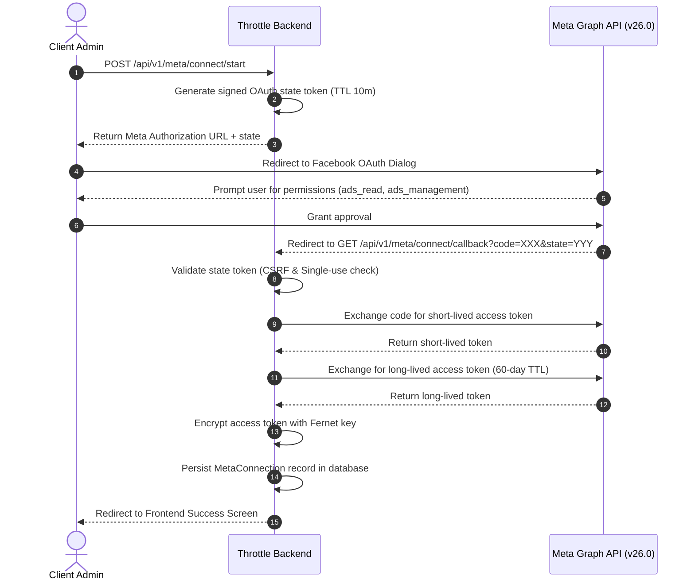

# Throttle External Integrations Guide

This document details external system integrations, with a primary focus on the **Meta Marketing API (v26.0)**.

---

## 1. Meta Marketing API Integration Overview

The Throttle backend includes a complete production-grade integration with Meta Marketing API to allow agency clients to connect their Meta Ad Accounts and sync real-time marketing analytics, ad spend, and conversion metrics.

### Key Components

| Component | File Path | Description |
|---|---|---|
| **API Router** | `app/api/v1/meta.py` | Exposes OAuth endpoints, connection management, account selection, sync triggers, and status checks. |
| **Meta API Client** | `app/services/meta_api_client.py` | Asynchronous HTTP client wrapper (`httpx`) for Meta Graph API v26.0 endpoints. |
| **Sync Service** | `app/services/meta_sync_service.py` | Orchestrates multi-entity synchronization (Ad Accounts, Campaigns, Ad Sets, Ads, Daily Insights). |
| **Token Encryption** | `app/core/crypto.py` | Handles Fernet symmetric token encryption and decryption at rest. |
| **CSRF State Manager** | `app/core/oauth_state.py` | Manages single-use cryptographically signed OAuth state tokens with TTL window. |

---

## 2. Meta OAuth 2.0 Web Flow

---

## 3. Token Security & Encryption at Rest

Access tokens provided by Meta grant access to ad accounts and marketing data. To safeguard these credentials:
- Tokens are **NEVER** stored in plain text in the database.
- Before saving to the `meta_connections` table, tokens are encrypted using **Fernet Symmetric Encryption** (`app/core/crypto.py`).
- The Fernet encryption key is configured via `META_ENCRYPTION_KEY` in environment settings.
- If `META_ENCRYPTION_KEY` is omitted, the system dynamically derives a key from `SECRET_KEY`.

---

## 4. Analytics Calculations & Safe Metrics

The sync service calculates real-time advertising performance metrics from raw Meta Graph API responses:

$$\text{CPM} = \left(\frac{\text{Spend}}{\text{Impressions}}\right) \times 1000$$

$$\text{CTR} = \left(\frac{\text{Clicks}}{\text{Impressions}}\right) \times 100$$

$$\text{CPC} = \frac{\text{Spend}}{\text{Clicks}}$$

$$\text{CPL} = \frac{\text{Spend}}{\text{Leads}}$$

$$\text{ROAS} = \frac{\text{Conversion Value}}{\text{Spend}}$$

### Division-by-Zero Protection
All metric calculations (`app/api/v1/analytics.py` and `app/services/meta_sync_service.py`) enforce zero-guard protection to prevent `NaN` or `Inf` floating-point anomalies when impressions, clicks, or spend are zero.

---

## 5. Development & Demo Mode

For environments without active Meta App Dashboard credentials:
- The backend provides `POST /api/v1/meta/demo-connect`.
- Demo mode creates a simulated Meta Connection for the active organization with realistic historical ad spend, campaigns, and insights.
- The `meta_is_configured` setting property automatically detects placeholder credentials vs real production Meta App credentials.
